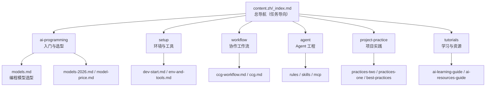

# CLAUDE.md（ai-guide）

**时间戳**：2026-03-04T13:47:07+08:00  
**一句话描述**：面向有经验开发者的任务导向中文指南：选模型与工具 → 搭环境接模型 → 建立协作工作流 → 用项目实践跑通闭环。  
**技术栈**：Hugo（Extended，主题 `hugo-book`）+ Markdown 内容（`content.zh/`）+ GitHub Pages 部署（`.github/workflows/hugo.yml`）。

## 关键入口（先看这些）

- **站点配置**：`hugo.toml`
- **仓库入口**：`README.md`
- **站点首页（内容入口）**：`content.zh/_index.md`
- **主线栏目入口（建议阅读起点）**
  - `content.zh/ai-programming/_index.md`：入门与选型（含选模型）
  - `content.zh/setup/_index.md`：环境与工具
  - `content.zh/workflow/_index.md`：协作工作流（CCG、GSD 等）
  - `content.zh/agent/_index.md`：Agent 工程（Rules/Skills/MCP/Hooks/Subagents）
  - `content.zh/project-practice/_index.md`：项目实践（端到端闭环）
  - `content.zh/tutorials/_index.md`：学习与资源

## 本地开发（Hugo）

```bash
git submodule update --init --recursive
hugo server
```

默认地址：`http://localhost:1313`

## 目录结构（导航用）

```text
ai-guide/
├── hugo.toml
├── content.zh/                  # 中文内容（Markdown）
│   ├── _index.md                # 站点首页/总导航
│   ├── ai-programming/          # 主线：入门与选型（含选模型）
│   ├── setup/                   # 主线：环境与工具
│   ├── workflow/                # 主线：协作工作流
│   ├── agent/                   # 主线：Agent 工程
│   ├── project-practice/        # 主线：项目实践
│   ├── tutorials/               # 主线：学习与资源
│   ├── large-models/            # 归档（侧栏隐藏）
│   └── open-source-community/   # 归档（侧栏隐藏）
├── layouts/                     # 主题覆盖（局部自定义）
│   ├── partials/docs/inject/     # head/body/footer 注入点
│   └── _default/_markup/         # Markdown 渲染覆盖（如链接策略）
├── assets/                      # 站点构建资源（如 custom.scss）
├── static/                      # 静态资源（图片、JS 等）
├── .github/                     # CI、Issue/PR 模板
├── .spec-workflow/              # 规格/需求/任务模板（可选工作流）
└── issues/                      # 仓库内的任务记录/草案
```

## 站点/内容结构图（Mermaid）



## 内容模块（入口与定位）

- **入门与选型（`content.zh/ai-programming/`）**
  - **入口**：`content.zh/ai-programming/_index.md`
  - **代表页面**：`models.md`、`models-2026.md`、`coding-plan.md`、`code-cli.md`
- **环境与工具（`content.zh/setup/`）**
  - **入口**：`content.zh/setup/_index.md`
  - **代表页面**：`dev-start.md`、`env-and-tools.md`、`zcf.md`、`cc-switch.md`、`cpa.md`
- **协作工作流（`content.zh/workflow/`）**
  - **入口**：`content.zh/workflow/_index.md`
  - **代表页面**：`ccg-workflow.md`、`ccg.md`、`gsd.md`
- **Agent 工程（`content.zh/agent/`）**
  - **入口**：`content.zh/agent/_index.md`
  - **代表页面**：`rules.md`、`skills.md`、`mcp.md`、`hooks.md`、`subagents.md`
- **项目实践（`content.zh/project-practice/`）**
  - **入口**：`content.zh/project-practice/_index.md`
  - **代表页面**：`practices-two.md`、`practices-one.md`、`best-practices.md`、`everything-claude-code.md`
- **学习与资源（`content.zh/tutorials/`）**
  - **入口**：`content.zh/tutorials/_index.md`
  - **代表页面**：`ai-learning-guide.md`、`ai-resources-guide.md`、`awesome-llm-apps.md`

## 导航面包屑（统一格式）

**格式**：`ai-guide / <模块> / <页面>`  
**示例**：
- `ai-guide / ai-programming / models`
- `ai-guide / setup / dev-start`
- `ai-guide / agent / workflow`
- `ai-guide / project-practice / practices-two`

## 主题与渲染（与导航相关的“非内容”点）

- **主题**：`hugo-book`（见 `hugo.toml` 的 `theme = 'hugo-book'`）
- **自定义注入点**：`layouts/partials/docs/inject/`
  - `head.html`：加载 `assets/custom.scss`
  - `body.html`：回到顶部按钮
  - `footer.html`：页脚额外内容 + medium-zoom 脚本
- **链接渲染覆盖**：`layouts/_default/_markup/render-link.html`（对部分链接强制 `target="_blank"`）

## 贡献与规范入口

- **贡献指南**：`CONTRIBUTING.md`
- **PR 模板**：`.github/PULL_REQUEST_TEMPLATE.md`
- **Issue 模板**：`.github/ISSUE_TEMPLATE/*.yml`
- **安全策略**：`SECURITY.md`
- **规格工作流模板（可选）**：`.spec-workflow/templates/*.md`（可由 `.spec-workflow/user-templates/` 覆盖）

