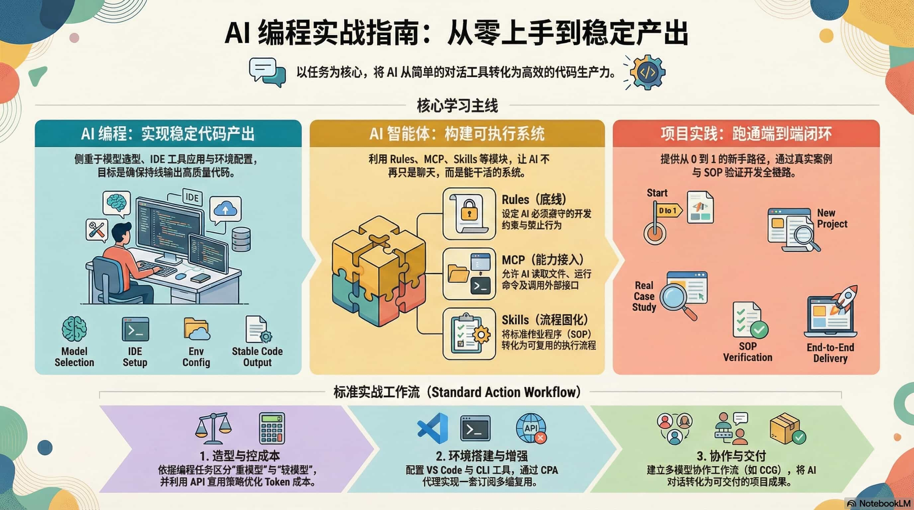

<div align="center">

# AI 编程指南

**面向有经验开发者的任务导向中文指南**

选模型与工具 → 搭环境接模型 → 协作流程 → Agent 工程 → 项目实战闭环

[](https://ai-guide.180813.xyz/)
[](LICENSE)
[](https://gohugo.io/)
[](https://github.com/rockyflux/ai-guide/actions/workflows/hugo.yml)
[](https://github.com/rockyflux/ai-guide/stargazers)

</div>

---

## 这是什么

把 AI 从「偶尔能用」变成「稳定交付」的中文实践指南。内容按任务组织，不按概念堆砌。

适合：已有开发经验，想系统落地 AI 编程、多 Agent 协作与项目级 SOP 的人。



## 七条主线

| 主线 | 解决什么问题 |
| --- | --- |
| [选型与上手](https://ai-guide.180813.xyz/ai-programming/) | 上手、选模型、选工具 / 套餐、控成本 |
| [环境配置](https://ai-guide.180813.xyz/setup/) | 开发环境、WSL、供应商切换与增强工具 |
| [协作流程](https://ai-guide.180813.xyz/workflow/) | 多模型协作、多 Agent 编排、规格驱动闭环 |
| [Agent 工程](https://ai-guide.180813.xyz/agent/) | Rules / Skills / MCP / Hooks / Subagents |
| [项目实战](https://ai-guide.180813.xyz/project-practice/) | 从案例到 SOP，把 AI 用进真实交付 |
| [学习资源](https://ai-guide.180813.xyz/tutorials/) | 系统学习、社区资源与 Awesome 合集 |

### 1. 选模型、选工具、控成本

- [AI 编程模型选型](https://ai-guide.180813.xyz/ai-programming/models/) — 能力 × 成本 × 任务适配
- [AI Coding Plan 订阅选型](https://ai-guide.180813.xyz/ai-programming/coding-plan/) — 套餐怎么选更划算
- [AI 编程工具汇总](https://ai-guide.180813.xyz/ai-programming/vb-code-tool/) — IDE / 插件 / Agent 工具对比
- [AI CLI 工具横评](https://ai-guide.180813.xyz/ai-programming/code-cli/) — Claude Code / Codex / Gemini CLI 等
- [AI 编程省钱之道](https://ai-guide.180813.xyz/ai-programming/ai-coding-save-money/) — 免费额度、Token 与多端复用
- [2026 年主流大模型盘点](https://ai-guide.180813.xyz/ai-programming/models-2026/) · [价格对比](https://ai-guide.180813.xyz/ai-programming/model-price/)

### 2. 一次把环境与模型接口配好

- [开发环境准备](https://ai-guide.180813.xyz/setup/dev-start/) — 基础工具链一站式准备
- [WSL + Claude Code](https://ai-guide.180813.xyz/setup/wsl/) — Windows 下更顺手的 Linux 开发环境
- [环境配置与增强工具集](https://ai-guide.180813.xyz/setup/env-and-tools/) — 环境变量、供应商切换、常用增强
- [ZCF](https://ai-guide.180813.xyz/setup/zcf/) · [CC-Switch](https://ai-guide.180813.xyz/setup/cc-switch/) · [CPA](https://ai-guide.180813.xyz/setup/cpa/)

### 3. 把「对话」升级成可交付工作流

- [协作流程入口](https://ai-guide.180813.xyz/workflow/) — 编排与闭环工具总索引
- [工作流项目集](https://ai-guide.180813.xyz/workflow/ccg-workflow/) — 协作类项目列表与选型
- [CCG](https://ai-guide.180813.xyz/workflow/ccg/) · [GSD](https://ai-guide.180813.xyz/workflow/gsd/) · [Superpowers](https://ai-guide.180813.xyz/workflow/superpowers/)
- [oh-my-claudecode](https://ai-guide.180813.xyz/workflow/oh-my-claudecode/) · [Trellis](https://ai-guide.180813.xyz/workflow/trellis/)

### 4. 搭可长期复用的 Agent 体系

- [Agent 工作流](https://ai-guide.180813.xyz/agent/workflow/) — 规则、工具、子 Agent 编排
- [Rules](https://ai-guide.180813.xyz/agent/rules/) · [Skills](https://ai-guide.180813.xyz/agent/skills/) · [MCP](https://ai-guide.180813.xyz/agent/mcp/)
- [Hooks](https://ai-guide.180813.xyz/agent/hooks/) · [Subagents](https://ai-guide.180813.xyz/agent/subagents/) · [Commands](https://ai-guide.180813.xyz/agent/commands/)

### 5. 照着案例跑通完整项目

- [新手端到端路径](https://ai-guide.180813.xyz/project-practice/practices-two/) — 站内内容按闭环顺序串起来
- [Cursor 上手](https://ai-guide.180813.xyz/project-practice/cursor/) · [Codex 上手](https://ai-guide.180813.xyz/project-practice/codex/)
- [案例练手](https://ai-guide.180813.xyz/project-practice/practices-one/) · [需求到设计原型](https://ai-guide.180813.xyz/project-practice/requirements-to-design-prototype/)
- [Claude Code 最佳实践](https://ai-guide.180813.xyz/project-practice/best-practices/) · [Everything Claude Code](https://ai-guide.180813.xyz/project-practice/everything-claude-code/)
- [Kiro 实战](https://ai-guide.180813.xyz/project-practice/kiro-practice/) · [Stitch × Figma × MCP](https://ai-guide.180813.xyz/project-practice/google-stitch-figma-mcp/)

> 完整导航与更多页面见 [在线站点首页](https://ai-guide.180813.xyz/)。

## 仓库结构

```text
ai-guide/
├── content.zh/          # 中文内容（Markdown）
│   ├── ai-programming/  # 选型与上手（含选模型）
│   ├── setup/           # 环境配置
│   ├── workflow/        # 协作流程
│   ├── agent/           # Agent 工程
│   ├── project-practice/# 项目实战
│   ├── tutorials/       # 学习资源
│   ├── large-models/    # 归档（侧栏隐藏）
│   └── open-source-community/  # 归档（侧栏隐藏）
├── layouts/             # 主题局部覆盖
├── assets/ · static/    # 样式与静态资源
└── .github/             # CI 与 Issue / PR 模板
```

## 本地开发

需要 **Hugo Extended 0.148.0+** 与 Git：

```bash
git submodule update --init --recursive
hugo server
```

访问：`http://localhost:1313`

## 参与贡献

- [贡献指南](CONTRIBUTING.md) — Fork → 改 `content.zh/` → 本地预览 → PR
- [安全策略](SECURITY.md)
- [Issues](https://github.com/rockyflux/ai-guide/issues) · [Discussions](https://github.com/rockyflux/ai-guide/discussions)

## 许可证

[MIT](LICENSE)

---

<div align="center">

如果这个仓库对你有帮助，欢迎点个 Star。

</div>
