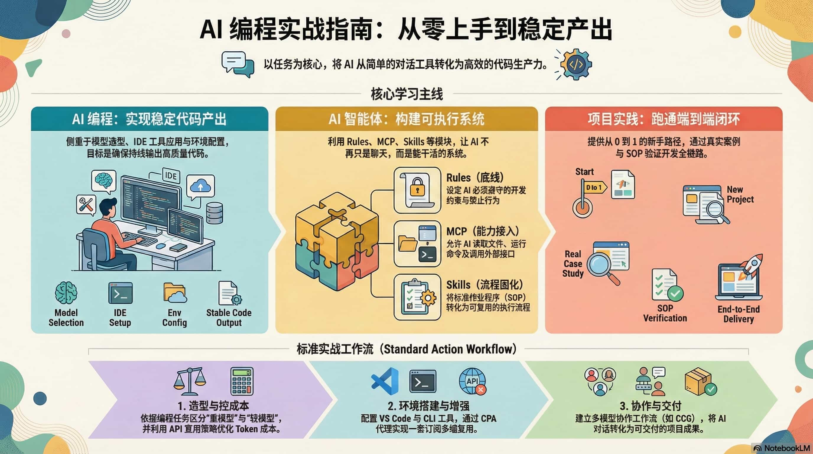

<div align="center">

# AI 编程指南

**面向有经验开发者的任务导向中文指南**

选模型与工具（含环境） → AI 应用选型 → Agent 工程 → 项目实战 → 学习资源

[](https://ai-guide.180813.xyz/)
[](LICENSE)
[](https://gohugo.io/)
[](https://github.com/rockyflux/ai-guide/actions/workflows/hugo.yml)
[](https://github.com/rockyflux/ai-guide/stargazers)

</div>

---

## 这是什么

把 AI 从「偶尔能用」变成「稳定交付」的中文实践指南。内容按任务组织，不按概念堆砌。

适合：已有开发经验，想系统落地 AI 编程、多 Agent 协作与项目级 SOP 的人。



## 五条主线

| 主线 | 解决什么问题 |
| --- | --- |
| [AI 编程选型](https://ai-guide.180813.xyz/ai-programming/) | 选模型、选工具 / 套餐、配环境与增强、控成本（含[协作工作流选型](https://ai-guide.180813.xyz/ai-programming/ccg-workflow/)） |
| [AI 应用选型](https://ai-guide.180813.xyz/ai-products/) | 办公 Agent、对话、智能体、绘图视频与 OpenClaw 生态 |
| [Agent 工程](https://ai-guide.180813.xyz/agent/) | Rules / Skills / MCP / Hooks / Subagents |
| [项目实战](https://ai-guide.180813.xyz/project-practice/) | 从案例到 SOP，把 AI 用进真实交付（含 [WSL](https://ai-guide.180813.xyz/project-practice/wsl/)） |
| [学习资源](https://ai-guide.180813.xyz/tutorials/) | 系统学习、社区资源与 Awesome 合集 |

### 1. 选模型、选工具、配环境、控成本

- [Coding Plan 与渠道](https://ai-guide.180813.xyz/ai-programming/coding-plan/) — 套餐怎么选更划算
- [编程工具对比](https://ai-guide.180813.xyz/ai-programming/vb-code-tool/) — IDE / 插件 / Agent 工具对比
- [编程 Agent 横评](https://ai-guide.180813.xyz/ai-programming/code-cli/) — Claude Code / Codex / Gemini CLI 等
- [协作工作流选型](https://ai-guide.180813.xyz/ai-programming/ccg-workflow/) — 多 Agent / SDD / Skills 协作范式选型
- [开发环境准备](https://ai-guide.180813.xyz/ai-programming/dev-start/) · [环境增强工具集](https://ai-guide.180813.xyz/ai-programming/env-and-tools/) · [卸载与清理](https://ai-guide.180813.xyz/ai-programming/cleanup-uninstall/)
- [省钱与 Token 治理](https://ai-guide.180813.xyz/ai-programming/ai-coding-save-money/) — 免费额度、Token 与多端复用
- [大模型价格](https://ai-guide.180813.xyz/ai-programming/model-price/)

### 2. 按场景选 AI 应用

- [AI 办公桌面端](https://ai-guide.180813.xyz/ai-products/ai-office-desktop/) — WorkBuddy、DuMate、千问办公等
- [AI 对话工具](https://ai-guide.180813.xyz/ai-products/ai-chat-tools/) — ChatGPT、豆包、Kimi、DeepSeek 等
- [AI 智能体平台](https://ai-guide.180813.xyz/ai-products/ai-super-agent/) — Manus、AutoGLM、Genspark、天工等
- [AI 绘图工具](https://ai-guide.180813.xyz/ai-products/ai-image-tools/) · [AI 视频工具](https://ai-guide.180813.xyz/ai-products/ai-video-tools/)
- [Awesome OpenClaw 使用案例](https://ai-guide.180813.xyz/ai-products/awesome-openclaw/) — OpenClaw 生态速览

### 3. 把「对话」升级成可交付工作流

- [协作工作流选型](https://ai-guide.180813.xyz/ai-programming/ccg-workflow/) — 协作类项目列表与选型（主入口）
- [CCG](https://ai-guide.180813.xyz/workflow/ccg/) · [GSD](https://ai-guide.180813.xyz/workflow/gsd/) · [Superpowers](https://ai-guide.180813.xyz/workflow/superpowers/)
- [oh-my-claudecode](https://ai-guide.180813.xyz/workflow/oh-my-claudecode/) · [Trellis](https://ai-guide.180813.xyz/workflow/trellis/)

### 4. 搭可长期复用的 Agent 体系

- [Rules](https://ai-guide.180813.xyz/agent/rules/) · [Skills](https://ai-guide.180813.xyz/agent/skills/) · [MCP](https://ai-guide.180813.xyz/agent/mcp/)
- [Hooks](https://ai-guide.180813.xyz/agent/hooks/) · [Subagents](https://ai-guide.180813.xyz/agent/subagents/) · [Commands](https://ai-guide.180813.xyz/agent/commands/)

### 5. 照着案例跑通完整项目

- [新手端到端路径](https://ai-guide.180813.xyz/project-practice/practices-two/) — 站内内容按闭环顺序串起来
- [Cursor 上手](https://ai-guide.180813.xyz/project-practice/cursor/) · [Codex 上手](https://ai-guide.180813.xyz/project-practice/codex/)
- [WSL + Claude Code](https://ai-guide.180813.xyz/project-practice/wsl/) — Windows 下更顺手的 Linux 开发环境
- [案例练手](https://ai-guide.180813.xyz/project-practice/practices-one/) · [需求到设计原型](https://ai-guide.180813.xyz/project-practice/requirements-to-design-prototype/)
- [Claude Code 最佳实践](https://ai-guide.180813.xyz/project-practice/best-practices/) · [Everything Claude Code](https://ai-guide.180813.xyz/project-practice/everything-claude-code/)
- [Kiro 实战](https://ai-guide.180813.xyz/project-practice/kiro-practice/) · [Stitch × Figma × MCP](https://ai-guide.180813.xyz/project-practice/google-stitch-figma-mcp/)

### 6. 系统学习与站外资源

- [AI 学习资源指南](https://ai-guide.180813.xyz/tutorials/ai-learning-guide/) — 官方课程、公开课与开源书
- [AI 资源与工具指南](https://ai-guide.180813.xyz/tutorials/ai-resources-guide/) — 站内精选 + 社区 / 资讯入口
- [菜鸟教程 AI / 智能开发](https://ai-guide.180813.xyz/tutorials/runoob-online-tutorials/) — RUNOOB 中文 AI 教程速查表
- [GitHub 周边工具速查](https://ai-guide.180813.xyz/tutorials/github-extensions/) — 加速、仓库阅读与效率工具

> 完整导航与更多页面见 [在线站点首页](https://ai-guide.180813.xyz/)。

## 仓库结构

```text
ai-guide/
├── content.zh/          # 中文内容（Markdown）
│   ├── ai-programming/  # AI 编程选型（含环境、协作工作流）
│   ├── ai-products/     # AI 应用选型
│   ├── setup/           # CC-Switch/ZCF/CPA 等专页（侧栏隐藏）
│   ├── workflow/        # 协作专页（侧栏隐藏）
│   ├── agent/           # Agent 工程
│   ├── project-practice/# 项目实战（含 WSL）
│   ├── tutorials/       # 学习资源
│   ├── large-models/    # 归档（侧栏隐藏）
│   └── open-source-community/  # 归档（侧栏隐藏）
├── layouts/             # 主题局部覆盖
├── assets/ · static/    # 样式与静态资源
└── .github/             # CI 与 Issue / PR 模板
```

## 本地开发

需要 **Hugo Extended 0.148.0+** 与 Git：

```bash
git submodule update --init --recursive
hugo server
```

访问：`http://localhost:1313`

## 参与贡献

- [贡献指南](CONTRIBUTING.md) — Fork → 改 `content.zh/` → 本地预览 → PR
- [安全策略](SECURITY.md)
- [Issues](https://github.com/rockyflux/ai-guide/issues) · [Discussions](https://github.com/rockyflux/ai-guide/discussions)

## 许可证

[MIT](LICENSE)

---

<div align="center">

如果这个仓库对你有帮助，欢迎点个 Star。

</div>
