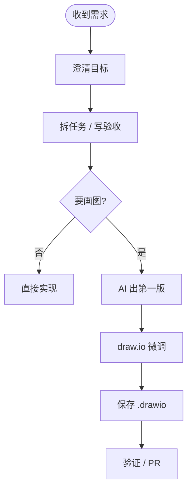

## 用 draw.io 快速画三类常用图

目标很简单：**用 AI 出第一版图 → 在 draw.io 里改 → 保存 `.drawio` 进仓库**。

常用三类：流程图、时序图、用例图。两条路任选其一。

## 选一条路装好

### 路线 A：官方 MCP（推荐）

- npm：[@drawio/mcp](https://www.npmjs.com/package/@drawio/mcp)
- 仓库：[jgraph/drawio-mcp](https://github.com/jgraph/drawio-mcp)

按仓库说明接到你的 Agent 即可。

### 路线 B：Skill（更轻量）

把画图提示词打成可复用 Skill，目录大致是：

```text
$HOME/.agents/skills/drawio-diagram/
├── SKILL.md
└── references/
    └── claude-project-instructions.md
```

<iframe onload='javascript:(function(o){o.style.height=o.contentWindow.document.body.scrollHeight+"px";}(this));' loading="lazy" style="width: 100%;height: 300px;" src="https://www.codecopy.cn/embed/kw5xfz" border="0" frameborder="no" framespacing="0" allowfullscreen="true"></iframe>

## 怎么用

直接说你要什么图：

- `画一个从需求到合并 PR 的流程图`
- `画一个 TCP 连接流程时序图`
- `画一个用户注册用例图`

装了 Skill 也可以：`/drawio-diagram 画一个 TCP 连接流程时序图`（英文加 `en`）。

出图后打开 [draw.io](https://app.diagrams.net/) 微调，最后把源文件存到仓库，例如 `static/diagrams/drawio/<name>.drawio`。

## 示例：流程图



本仓库已有对应源文件，可直接打开改：

- [flowchart-ai-coding.drawio](/diagrams/drawio/flowchart-ai-coding.drawio)
- [sequence-ai-coding.drawio](/diagrams/drawio/sequence-ai-coding.drawio)
- [usecase-ai-coding.drawio](/diagrams/drawio/usecase-ai-coding.drawio)
