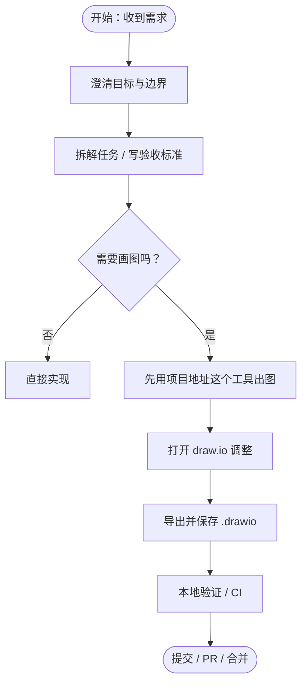
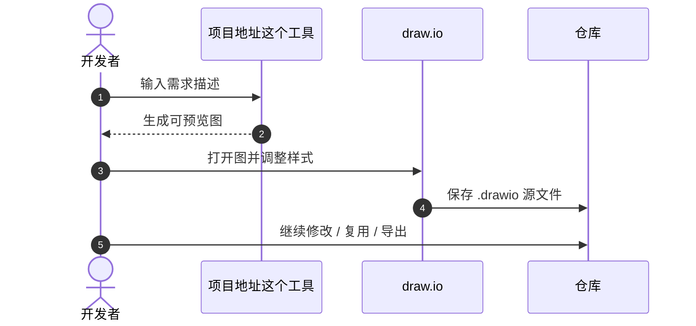
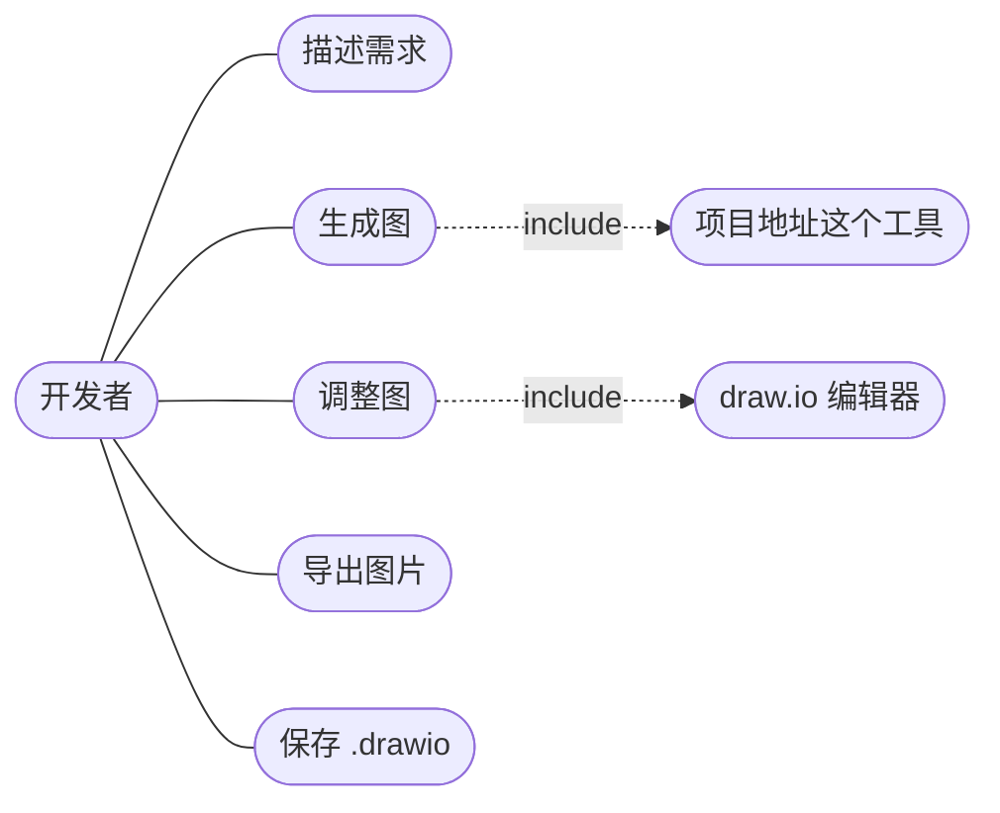

## 用 draw.io 快速跑通三类常用图

这篇文章不讲概念，只讲怎么直接用起来。

draw.io 官方已经推出 **官方 MCP Server**。如果你本来就在用 MCP，直接走官方方案就行。

如果你想要更轻量一点，也可以用这里的 **Skills 方案**，把 draw.io 的提示词整理成一个可复用的 `drawio-diagram` skill。

最实战的流程就是三步：

1. 用**项目地址这个工具**先把图生成出来
2. 再在 draw.io 里二次编辑
3. 最后保存 `.drawio` 源文件，方便后续维护

本文只看三类最常用的图：

- **流程图**（Flowchart）
- **时序图**（Sequence）
- **用例图**（Use Case）

## 先说结论

想快速画图并且能继续改，最省事的方式就两条：

- **MCP 路线**：直接用 draw.io 官方 MCP Server
- **Skills 路线**：先用项目地址这个工具生成，再打开 draw.io 调整

共同点也很简单：

- 先出结果
- 后面能继续改
- 可以沉淀为仓库资产

## 安装

### 官方 MCP 路线

如果你喜欢用 MCP，优先用 draw.io 官方 MCP Server。

相关地址：

- 官方推文：<https://x.com/drawio/status/2020918870375370825>
- npm 包：<https://www.npmjs.com/package/@drawio/mcp>
- GitHub 仓库：<https://github.com/jgraph/drawio-mcp>

### Skills 路线

如果你更喜欢轻量提示词方案，可以用 `drawio-diagram` skill。

这个方案基于 draw.io 官方提供的替代提示词思路，把生成流程包装成更适合日常使用的 Skill。

Skill 目录结构通常是：

```shell
$HOME/.agents/skills/drawio-diagram
├── SKILL.md
└── references
    └── claude-project-instructions.md
```
<iframe onload='javascript:(function(o){o.style.height=o.contentWindow.document.body.scrollHeight+"px";}(this));' loading="lazy" style="width: 100%;height: 300px;"  src="https://www.codecopy.cn/embed/kw5xfz"  border="0" frameborder="no" framespacing="0" allowfullscreen="true"></iframe>

## 使用

### 方式 1：直接输入提示词

你可以直接说：

- `画一个 TCP 连接流程时序图`
- `画一个项目发布流程图`
- `画一个用户注册用例图`

默认会生成中文说明；如果想要英文，可以直接说：

- `用英语画一个 TCP 连接流程时序图`

### 方式 2：使用命令

如果你已经装好了 Skill，也可以直接用命令：

- `/drawio-diagram 画一个 TCP 连接流程时序图`
- `/drawio-diagram en 画一个 TCP 连接流程时序图`

### 使用步骤

无论你走 MCP 还是 Skills，基本流程都一样：

1. 描述你要画的图
2. 生成可预览版本
3. 打开 draw.io 调整细节
4. 保存 `.drawio` 源文件

## 效果

### 输入一个需求

比如你输入：

- `画一个 TCP 连接流程时序图`
- `画一个从需求到合并 PR 的流程图`

### 会得到什么

通常会得到三层结果：

- **可预览的图**：先看结构对不对
- **可编辑的内容**：方便继续微调
- **`.drawio` 源文件**：方便后续复用和导出

### 推荐的实战节奏

1. 先生成第一版
2. 再打开 draw.io 做二次编辑
3. 最后保存为 `.drawio` 源文件

## 原理

### draw.io 官方 MCP 的思路

官方 MCP 的核心方式是：

- 先把图的内容编码成可渲染的格式
- 再通过浏览器打开 `app.diagrams.net`
- 让 draw.io 直接渲染和编辑

### Skills 方案的思路

Skills 方案的核心是：

- 用更轻量的提示词和说明来驱动生成
- 通过 Skill 复用固定的画图规则
- 让“画图”变成一种可以重复执行的工作流

### 为什么把图当成资产

因为在项目里，图真正有价值的地方不是“第一次画出来”，而是：

- 后面还能改
- 能持续复用
- 能沉淀成仓库资产

所以不管走 MCP 还是 Skills，最终都应该落回 `.drawio` 源文件。

## 示例 1：流程图

这个例子最适合第一次尝试：从需求到合并 PR 的流程图。



要点：

- 分支一定要有收敛点
- 验收标准最好直接画进流程里
- 如果图里有反馈环，通常比主路径更接近真实项目

## 示例 2：时序图

这个图适合讲清楚“谁先做什么、谁再反馈什么”。



要点：

- 先生成，再编辑，是最稳的节奏
- 工具负责出图，draw.io 负责精修
- 源文件一定要留在仓库里

## 示例 3：用例图视角

如果你想梳理“项目里有哪些动作”，可以用用例视角来画。



说明：

- 这个版本更适合文档里快速预览
- 如果你要严格 UML 样式，可以继续用 draw.io 精修

## 快速上手模板

如果你想马上开始，就直接复制下面这段：

```text
我要用项目地址这个工具快速画一张图，并且最终保存为 draw.io 源文件。

目标：
- 这张图要说明：<一句话描述>

边界：
- 从 <开始> 到 <结束>
- 不包含：<不画哪些细节>

参与者 / 模块：
- <列出 3~8 个关键命名，保持统一>

输出要求：
- 先生成一个可预览版本
- 再输出可编辑的 .drawio 源文件
- 文件保存到：static/diagrams/drawio/<name>.drawio
```
